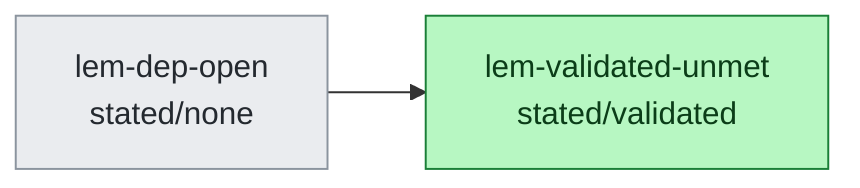

<!-- GENERATED by scripts/argument.py --generate. Do not hand-edit. -->
<!-- OR-routes: `<id>__routeN` rhombus = one alternative route; solid edges into it are that route's conjunctive members; the dashed `OR` edge into `<id>` means any single route suffices. Unconditional deps draw plain solid edges. -->
# Argument DAG (2 results, 1 edges)

**Proof-status legend:** 🟩 validated · 🟦 proved · 🟨 seeded · ⬜ stated · 🟪 cited · 🟧 proved-mod-audit/conjecture/heuristic/numerical (NON-rigorous) · 🟥 open

